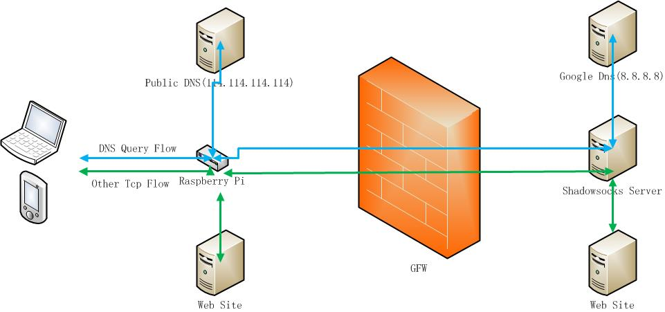

# RpiProxy
Make a Raspberry PI as a proxy route, work with shadowsocks server, provide clean dns/proxy service
> 前言：  
> 　　书籍是人类进步的阶梯，墙是阻碍人类进步的陷阱   --- 高尔基·马克西姆·方·滨兴
>  
> 　　翻墙的最佳姿势，当然是不在电脑/手机/pad上安装任何软件，不更改任何设置，就能访问到任何网址，墙变得透明了。
> 实现这个目标主要有两种做法：  
1. 刷路由器固件，用OpenWrt加上其它软件。这个方式适合爱折腾的玩家，也有上网不稳定的风险存在。  
2. 用一台专用电脑充当网关/DNS服务器，安装设置上专用软件。这种方式优点很多，还可以出差时随时携带。要说低成本电脑，
当然要首推树莓派了。本文就是专门介绍如何让树莓派做为透明翻墙网关。已经在Raspbian(Jiessie)和OSMC系统下面测试通过了。

> 说明：工作目录在/home/pi下面  
> 说明：用su取得root权限，我下面的命令不再加sudo前缀  
> 说明：我的安装配置都是按systemd系统的，较老的系统不适用  

> v2更新说明：本文的第一版写在2016年，这段时间内：  
  shadowsocks-libev升了很多版本，修正了一些bug，增加了更多的加密方式，用起来速度更快一些  
  chinadns已经停止维护很久了，ss-tunnel转发dns查询的模式也不太稳定，因此决定切换到[overture](https://github.com/shawn1m/overture)上去  
  [overture](https://github.com/shawn1m/overture)自带dns分流查询、TTL、缓存，因此个人使用也没必要安装dnsmasq了  
  整个架构就由shadowsocks-libev + overture构成，安装维护更简单了  

## 1.1、安装shadowsocks-libev
    vps服务端的安装教程网上汗牛充栋，这里就不详述了  
    但在树莓派上安装shadowsocks-libev最新版本却没那么容易，如果想自己编译安装，shadowsocks-libev的依赖库极多，  
    又有版本要求，比较繁琐，推荐从[Debian Backports](https://backports.debian.org/Instructions/)上安装最新版本  
    
    vi /etc/apt/sources.list  
    jessie版本加这行：  
         deb http://ftp.debian.org/debian jessie-backports main  
    stretch版本加这行：  
         deb http://ftp.debian.org/debian stretch-backports main  
    apt-get update  
    stretch版本执行这句：  
         apt-get install shadowsocks-libev -t jessie-backports  
    jessie版本执行这句：  
         apt-get install shadowsocks-libev -t stretch-backports  
    
## 1.2、禁用shadowsocks-libev-server服务，这个服务默认是打开的

    systemctl stop shadowsocks-libev.service
    systemctl disable shadowsocks-libev.service

## 1.3、配置启动shadowsocks-libev-redir服务

    vi /etc/shadowsocks-libev/ss-redir.json  
    格式如下：  
    {  
        "server":"境外shadowsocks服务器ip地址",  
        "server_port":境外shadowsocks服务器端口,  
        "local_address": "0.0.0.0",  
        "local_port":8888,  
        "password":"境外shadowsocks服务密码",  
        "timeout":3000,  
        "method":"chacha20-ietf-poly1305"  
    }  

    mv /lib/systemd/system/shadowsocks-libev-redir@.service /lib/systemd/system/shadowsocks-libev-redir.service  
    vi /lib/systemd/system/shadowsocks-libev-redir.service  
    注意这行：ExecStart=/usr/bin/ss-redir -c /etc/shadowsocks-libev/ss-redir.json  
    systemctl daemon-reload  
    systemctl enable shadowsocks-libev-redir  
    systemctl start shadowsocks-libev-redir  
    用下面这句检查运行状态  
    systemctl status shadowsocks-libev-redir  

## 1.4、配置启动shadowsocks-libev-local服务  

    注意：ss-redir是透明代理（转发）服务，ss-local是socket5转发服务，这个不同需要很清楚  
          在本文中，8888端口用于透明代理，1080端口用于socket5转发  
          ss-local给overture使用，用于向境外dns服务器查询  
          
    cp /etc/shadowsocks-libev/ss-redir.json /etc/shadowsocks-libev/ss-local.json  
    vi /etc/shadowsocks-libev/ss-local.json  
    {  
        "server":"境外shadowsocks服务器ip地址",  
        "server_port":境外shadowsocks服务器端口,  
        "local_address": "127.0.0.1",  
        "local_port":1080,  
        "password":"境外shadowsocks服务密码",  
        "timeout":3000,  
        "method":"chacha20-ietf-poly1305"  
    }  
    mv /lib/systemd/system/shadowsocks-libev-local@.service /lib/systemd/system/shadowsocks-libev-local.service  
    vi /lib/systemd/system/shadowsocks-libev-local.service  
    注意这行：ExecStart=/usr/bin/ss-local -c /etc/shadowsocks-libev/ss-local.json  
    systemctl daemon-reload  
    systemctl enable shadowsocks-libev-local  
    systemctl start shadowsocks-libev-local  
    用下面这句检查运行状态  
    systemctl status shadowsocks-libev-local  

## 2.1、设置nat转发规则

    vi /etc/sysctl.conf
    注意这句：net.ipv4.ip_forward = 1
    sysctl -p
    下载本项目文件/etc/shadowsocks-libev/iptables.up.rules
    修改你自己的Shadowsocks服务器ip
    vi /etc/network/if-pre-up.d/iptables
        #!/bin/bash
        /sbin/iptables-restore < /etc/shadowsocks-libev/iptables.up.rules
    chmod +x /etc/network/if-pre-up.d/iptables

    **注意：raspberry PI的发行版本OSMC中，不支持网络接口链接/断开脚本，做为临时办法，放到rc.local中执行

## 3.1、安装配置启动overture服务
    
    到https://github.com/shawn1m/overture下载安装，我的配置如下：  
    {  
      "BindAddress": ":53",  
      "PrimaryDNS": [  
        {  
        "Name": "aliDNS",  
        "Address": "114.114.115.115:53",  
        "Protocol": "udp",  
        "SOCKS5Address": "",  
        "Timeout": 6,  
        "EDNSClientSubnet": {  
          "Policy": "disable",  
          "ExternalIP": ""  
          }  
        }  
       ],  
      "AlternativeDNS": [  
      {  
        "Name": "googleDNS",  
        "Address": "8.8.8.8:53",  
        "Protocol": "tcp",  
        "SOCKS5Address": "127.0.0.1:1080",  
        "Timeout": 6,  
        "EDNSClientSubnet": {  
          "Policy": "disable",  
          "ExternalIP": ""  
        }  
      }  
    ],  
    "OnlyPrimaryDNS": false,  
    "RedirectIPv6Record": false,  
    "IPNetworkFile": "/etc/shadowsocks-libev/china_ip_list.txt",  
    "DomainFile": "/etc/shadowsocks-libev/gfwlist.txt",  
    "DomainBase64Decode": true,  
    "HostsFile": "/usr/bin/overture/hosts_sample",  
    "MinimumTTL": 86400,  
    "CacheSize" : 604800,  
    "RejectQtype": [255]  
  }  
    
    注意：境外辅助dns服务器需要支持tcp，走socket5代理模式  
    配置中指定的地址段china_ip_list，域名单gfwlist，都是众所周知的github项目，可自行下载，本项目内也有提供  
    接下来配置为自动启动的服务：  
    
    vi /lib/systemd/system/overture.service  
    格式如下：
    [Unit]
    Description=overture service
    
    [Service]
    ExecStart=/usr/bin/overture/overture-linux-arm -c /etc/shadowsocks-libev/overture.json
    Restart=on-failure
    RestartSec=42s
    
    [Install]
    WantedBy=multi-user.target

    systemctl daemon-reload
    systemctl enable overture
    systemctl start overture
    用下面这句检查运行状态
    systemctl status overture
